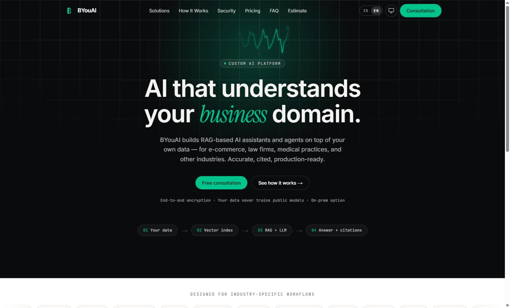

<div align="center">

# BYouAI

**Custom RAG-based AI assistants and agents for businesses: e-commerce, law firms, clinics and more.**

[](https://b-you-ai-7syo.vercel.app/en)


[**Live site**](https://b-you-ai-7syo.vercel.app/en) · [Indonesian version](https://b-you-ai-7syo.vercel.app/) · [AI consultation](https://b-you-ai-7syo.vercel.app/en/konsultasi) · [Security notes](SECURITY.md)



</div>

## Overview

BYouAI is the marketing site and lead-generation front end for an AI integration
service. The service builds retrieval-augmented generation (RAG) assistants on top
of a client's own data. The site is more than static pages. It includes:

- **A live AI consultation assistant.** It streams answers grounded in a pgvector
  knowledge base, shows citations, and uses tool calling to produce price
  estimates, flag call-back requests and save requirement notes.
- **Interactive industry demos** for e-commerce, law firms and clinics. They run
  entirely in the browser and show what a RAG agent does for each vertical.
- **A plan estimator and invoice generator** driven by a single pricing source.
- **Production hardening:** CSP and security headers, per-IP rate limiting, a
  global OpenAI cost ceiling, CSRF checks and input validation.
- **Bilingual UI (ID / EN)** with locale-aware routing, plus a light, dark or system theme.

> I designed and built this project end to end: product copy, UI, RAG pipeline,
> database schema, security hardening and deployment.

## Try it

| Page | What to look at |
| --- | --- |
| [Home](https://b-you-ai-7syo.vercel.app/en) | Landing page, RAG pipeline overview, pricing |
| [AI consultation](https://b-you-ai-7syo.vercel.app/en/konsultasi) | Streaming RAG chat with citations and tool-call action cards |
| [E-commerce solution](https://b-you-ai-7syo.vercel.app/en/solusi/e-commerce) | Agent workflow diagram, customer-chat sandbox, lead form (Server Action) |
| [Law firm demo](https://b-you-ai-7syo.vercel.app/en/solusi/firma-hukum) | Document analysis: clause extraction, tiered risk findings, Q&A with article references |
| [Clinic demo](https://b-you-ai-7syo.vercel.app/en/solusi/klinik-dokter) | Front-desk admin assistant simulation |
| [Plan estimate / invoice](https://b-you-ai-7syo.vercel.app/en/invoice) | Editable invoice generator (IDR / USD / EUR) |
| [Security](https://b-you-ai-7syo.vercel.app/en/keamanan) | Data handling and security posture |

> The industry demos are client-side simulations with curated data. They make no
> model calls. The consultation assistant is the part backed by real LLM calls.

## Architecture

```mermaid
flowchart LR
    U[Visitor] -->|intake form + messages| C["/konsultasi<br/>chat UI"]
    C -->|POST JSON| R["/api/konsultasi/chat<br/>Node route handler"]
    P["proxy.ts<br/>rate limit · CSRF · body size"] -.guards.-> R
    R -->|embed query| OE[OpenAI embeddings]
    R -->|match_knowledge_docs RPC| DB[(Supabase Postgres<br/>pgvector)]
    R -->|stream + tools| OC[OpenAI chat]
    R -->|leads · transcript · tool results| DB
    R -->|SSE: citations / token / action / done| C
    K[src/lib/knowledge.mts] -->|npm run ingest| DB
```



### How the consultation assistant works

1. The visitor fills a short intake form (name, email, industry, needs). Every
   request is validated with **Zod**.
2. The route embeds the latest question and runs a cosine-similarity search over
   `knowledge_docs` through the `match_knowledge_docs` RPC. Matching chunks go into
   the system prompt, and de-duplicated sources are sent to the client first as a
   `citations` frame.
3. The OpenAI chat completion streams back over **Server-Sent Events**
   (`text/event-stream`). The full frame contract lives in
   [`src/lib/consultation.ts`](src/lib/consultation.ts).
4. The model can call three tools, each rendered as an action card in the UI:
   - `build_estimate` returns a pre-filled link to the `/invoice` estimate.
   - `request_consultation_call` flags the lead for a call-back.
   - `save_requirement_notes` stores a structured summary of the requirements.
   Tool rounds are capped, and the final round runs without tools so the model
   always produces an answer.
5. Leads, transcripts and tool outcomes are written to Supabase on a
   **best-effort** basis. If Supabase or OpenAI is unavailable, the chat
   degrades gracefully instead of crashing: retrieval returns no results, or the
   stream ends with an `error` frame.

## Security highlights

Details are in [SECURITY.md](SECURITY.md).

- CSP, HSTS, `X-Frame-Options`, COOP/CORP and `Permissions-Policy` headers (`next.config.ts`)
- Per-IP rate limiting and a method allow-list in the Next.js 16 `proxy.ts`
- A process-wide ceiling on concurrent and per-minute OpenAI calls to cap cost
- CSRF protection through `Origin` / `Sec-Fetch-Site` checks, plus request body size limits
- Secrets stay server-side and are accessed through a typed `env` module
- All thresholds can be tuned through environment variables

## Tech stack

| Layer | Tools |
| --- | --- |
| Framework | Next.js 16 (App Router, Turbopack, Server Actions, `proxy.ts`), React 19 |
| Language / styling | TypeScript, Tailwind CSS v4 (`@theme` design tokens), `next/font` |
| AI | OpenAI chat completions (streaming, function calling), `text-embedding-3-small` |
| Data | Supabase Postgres + `pgvector`, plain SQL migrations with up/down files |
| Validation | Zod |
| Quality | ESLint, `tsc --noEmit`, Knip, `npm audit`, GitHub Actions CI |
| Hosting | Vercel |

## Project structure

```text
src/
├── app/
│   ├── [lang]/                # Localized pages (id = default, en = /en/...)
│   │   ├── page.tsx           # Landing page
│   │   ├── konsultasi/        # AI consultation chat UI
│   │   ├── solusi/            # Industry pages and interactive demos
│   │   └── invoice/           # Plan estimate / invoice generator
│   ├── api/konsultasi/chat/   # Streaming RAG + tool-calling route
│   └── opengraph-image.tsx    # Dynamic OG image
├── components/                # UI and page sections
├── dictionaries/              # ID / EN copy
├── lib/                       # rag, openai, supabase, env, rate-limit, plans, i18n
└── proxy.ts                   # Edge guard rails and locale rewrites
migrations/                    # Postgres schema (see migrations/README.md)
scripts/ingest.mts             # Embeds the knowledge base into pgvector
```

## Running locally

Requirements: Node.js 22+, and a Supabase project with the `vector` extension
enabled if you want the assistant to work.

```bash
npm install
cp .env.example .env.local   # fill in SUPABASE_URL, SUPABASE_SERVICE_ROLE_KEY, OPENAI_API_KEY
npm run dev                  # http://localhost:3000
```

To enable the consultation assistant:

1. Apply `migrations/0006` through `0010`. See [migrations/README.md](migrations/README.md).
2. Run `npm run ingest` to embed [`src/lib/knowledge.mts`](src/lib/knowledge.mts).
   Run it again whenever that file changes.

The site renders without any credentials. Only the assistant needs them.

### Scripts

| Command | Purpose |
| --- | --- |
| `npm run dev` | Development server (Turbopack) |
| `npm run build` / `npm run start` | Production build and serve |
| `npm run lint` | ESLint |
| `npm run typecheck` | TypeScript check |
| `npm run knip` | Find unused files, exports and dependencies |
| `npm run ingest` | Embed the knowledge base into `knowledge_docs` |

## Implementation notes

- **i18n.** Indonesian is the default and has no URL prefix. English lives under
  `/en`. `src/proxy.ts` rewrites bare paths to the internal `/id/...` route, and
  the language switcher stores the choice in a cookie.
- **Theming.** Color tokens live in `src/app/[lang]/globals.css`. An inline
  script in `src/app/[lang]/layout.tsx` applies the saved theme before first paint
  so the page does not flash.
- **Single pricing source.** `src/lib/plans.ts` feeds the pricing section, the
  forms and the invoice generator.
- **Verification log.** See [docs/konsultasi-check.md](docs/konsultasi-check.md)
  for build, API validation and degraded-mode checks on the assistant.

## Author

**Aswan** ([@Bajoel32](https://github.com/Bajoel32)) · AI engineer, building RAG and agent systems for real businesses.
